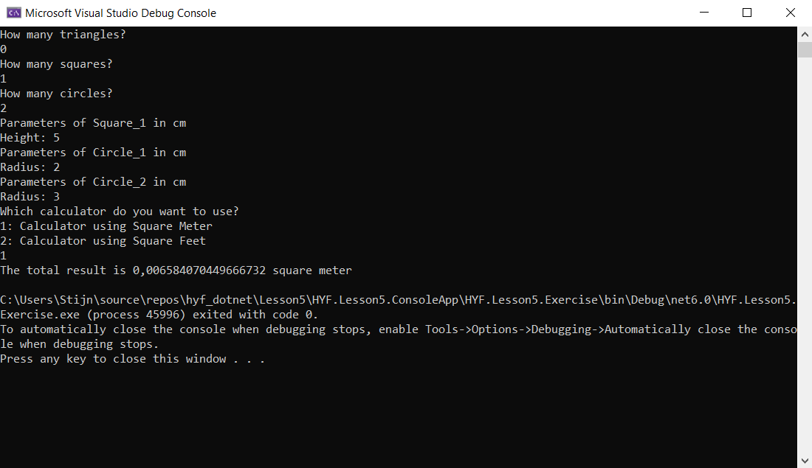

# Exercises and Study material Lesson 5

Exercise on interfaces: 
Create a console program to calculate the surface area of a given list of shapes. There are 4 different shapes: Square, Triangle, Rectangle and Circle. The dimensions of the shapes are in cm. There are 3 different types of calculators: CalculatorSquareCentiMeter, CalculatorSquareMeter CalculatorSquareFeet. The calculators will calculate the sum of the surface area of a list of shapes, correspondingly in square cm, square m or square feet. 

Create the Shapes and Calculators using interfaces where necessary.

An example of what the output of the console application can look like:

You don't have to follow this structure by any means, please give your own twist on how to add shapes and how to choose a calculator.

As an extension you can implement more shapes, more calculators of more functionality to the calculators (like calculating the circumference, calculating volume if you add 3D shapes ...)

Study material:
I highly suggest you take a look at the following video's, as they explain the concepts we handled this week very well. Especially the video's on dependency injection are very important, as providing exercises on this subject is not so straightforward.

https://www.youtube.com/watch?v=tTJetZj3vg0&t=613s
https://www.youtube.com/watch?v=Hhpq7oYcpGE&t=2762s
https://www.youtube.com/watch?v=A7qwuFnyIpM&t=1796s